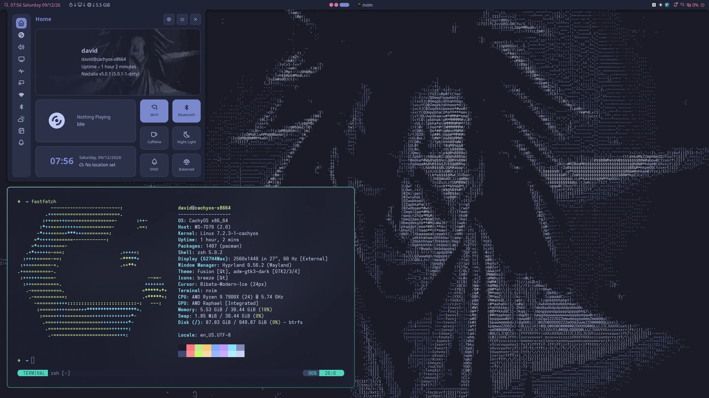

# CachyOS + Hyprland Desktop Config



[English](README.md) · [简体中文](README.zh-CN.md)

A complete configuration snapshot of one dialed-in CachyOS machine. The goal is
**reproducing it on another machine with a single command**.

> Snapshot: 2026-08-26
> Source machine: CachyOS · Hyprland 0.56+ · noctalia v5.0.0 · kitty 0.48.2 ·
> neovim 0.12.5 (LazyVim, 46 plugins) · zsh 5.9.2 + powerlevel10k 1.20.17

> ⚠ **This is a personal config, not a distribution.** It is tuned for one specific
> machine and one specific set of habits: a single DP-1 2560×1440 display, an AMD GPU,
> a Chinese input method, and keybindings built on muscle memory. Copying it verbatim
> onto a different machine will almost certainly need edits. `install.sh` overwrites
> config files under `$HOME` (each one is backed up to `.bak-<timestamp>` first; it
> needs no sudo and touches nothing outside `$HOME`), but **run `--dry-run` first**.
> `./uninstall.sh` rolls everything back.
>
> Licensing and third-party content (wallpapers from wallhaven, parts of the nvim
> config from LazyVim) is in [LICENSE](LICENSE).

> 📖 **A note on language.** This README and [INSTALL.md](INSTALL.md) are the parts you
> need to install the package and understand what it contains. The 11 documents under
> `docs/` — roughly 202 KB explaining *why* each choice was made — are **written in
> Chinese only**. They are linked below anyway, since the code blocks, file paths and
> config keys in them are readable regardless.

---

## 60-second start

```bash
git clone https://github.com/numb747/cachyOS-config.git cachyOS-config
cd cachyOS-config

sudo pacman -S --needed $(grep -vE '^\s*(#|$)' packages.txt | tr '\n' ' ')
./install.sh --dry-run    # see which files would be touched
./install.sh              # idempotent; every overwritten file is backed up first
```

Installing under a **different username** requires no edits. The few absolute paths
baked into the package (noctalia's `key_file`, wallpaper paths, the `Exec` line in
`wecom.desktop`) are rewritten to the current `$HOME` by `install.sh`'s `rewrite_home`.

Log out and back into Hyprland when it finishes. [INSTALL.md](INSTALL.md) has a
point-by-point acceptance checklist.

Installing only part of it:

```bash
./install.sh hypr nvim        # just these two modules
./install.sh --list           # list available modules
./install.sh --dry-run        # print what would happen, touch nothing
```

---

## What's in the package

| Module | Contents | Docs (zh) |
|---|---|---|
| **hypr** | Hyprland keymap (37 custom binds → 124 total), mouse behavior, purely dynamic workspaces, the "rack" scratchpad system, screen recording | [02](docs/02-hyprland.md) · [cheatsheet](docs/06-keymap-cheatsheet.md) |
| **term** | kitty (drops straight into nvim), alacritty, zsh, powerlevel10k | [03](docs/03-terminal.md) |
| **nvim** | LazyVim customization: mini.files, toggleterm, lualine, transparent tokyonight | [04](docs/04-neovim.md) |
| **ui** | noctalia bar wired to the theme engine, GTK/Qt/btop colors, fonts, cursor, input method, default applications | [05](docs/05-theme-ui.md) |
| **cc** | Claude Code: context-usage statusline, multi-session dashboard (`ccw`/`ccs`), pet TUI (`ccp`, which can answer a prompt sitting in another terminal) | [08](docs/08-claude-code.md) |
| **wall** | Tokyo Night wallpapers and palette, plus the script that generates the library | [05](docs/05-theme-ui.md#壁纸) |
| **wine** | `winapp`: a separate wine prefix + bubblewrap sandbox per Windows program; the working instance is WeCom | [09](docs/09-wine-apps.md) |
| **ocr** | Screen text grab on `Super+Shift/Alt+O`: a resident RapidOCR service replacing normcap, 0.33 s from selection to clipboard | [10](docs/10-ocr.md) |

Haven't installed the OS yet? Start with [docs/00-install-os.md](docs/00-install-os.md)
(Ventoy, images, the CachyOS trade-offs).
Design principles and how the modules interlock: [docs/01-architecture.md](docs/01-architecture.md).
When something breaks, [docs/07-troubleshooting.md](docs/07-troubleshooting.md) is
where the **actually encountered** problems live — it is not a generic FAQ.

---

## After you change something: pull it back into the package

The package is a snapshot; `~/.config/` is the real thing. **Edit the live files, then
let `sync.sh` collect them** — no need to remember which ones you touched:

```bash
./sync.sh              # show which files drifted (writes nothing)
./sync.sh --diff       # print each difference
./sync.sh --pull       # collect into the package, regenerate MANIFEST and hypr patches
./sync.sh --pack       # pull, then build a tar.gz
```

Want the package to manage a new file? Add one line to `manifest.map` —
`install.sh`, `uninstall.sh` and `sync.sh` all read it, so all three follow along.

> The one exception is the **hypr module**: `install.sh`'s `mod_hypr` calls `put`
> explicitly (so it can warn before overwriting the five upstream files) instead of
> going through `put_module`. When you add a file to the hypr section, you must **also**
> add a `put` line in `install.sh` — otherwise `sync.sh` will collect it and
> `install.sh` will never deploy it.

Some files are stored as **templates** rather than snapshots of this machine (for
example the `/home/$USER` in `qt6ct.conf`); pulling them would bake the local path into
the package. Those are marked `#@nopull <package path>` in `manifest.map`. `--pull` and
`--pack` skip them; `--check` still reports the mismatch and tags it
`[nopull · expected mismatch]`.

---

## Directory layout

```
cachyOS-config/                  repo root = the package itself (no intermediate dir)
├── README.md              ← you are here (English)
├── README.zh-CN.md        the same document in Chinese
├── CLAUDE.md              navigation for AI sessions (gotcha list + how to edit configs)
├── LICENSE                MIT + third-party attribution (wallpapers / LazyVim)
├── INSTALL.md             bare machine to working desktop, plus acceptance checklist
├── manifest.map           ★ the file map: package path ⇄ system path (shared by all three scripts)
├── install.sh             package → system (idempotent / per-module / --dry-run / auto backup)
├── sync.sh                system → package (collect live changes)
├── uninstall.sh           restore
├── packages.txt           pacman package list
├── MANIFEST.txt           sha256 of every tracked file (generated by sync.sh)
├── docs/                  11 documents, see the table above (Chinese)
├── home/                  .zshrc  .p10k.zsh
├── bin/                   → ~/.local/bin/
│   ├── hypr-screenrec     screen recording toggle (wl-screenrec), bound to Super+Shift/Alt+R
│   ├── winapp             per-app wine prefix + bubblewrap sandbox toolchain
│   ├── ocr-server         resident OCR service (RapidOCR, systemd socket activation)
│   └── ocr-grab           OCR client: screenshot → recognize → clipboard, Super+Shift/Alt+O
├── aur/                   AUR packages that needed patching (PKGBUILD archive, not installed to $HOME)
├── claude/                → ~/.claude/ (statusline / session dashboard / pet TUI)
├── config/                → ~/.config/
│   ├── hypr/              mykeys.lua + 5 patched upstream files + their .patch
│   ├── systemd/user/      ocrd.socket / ocrd.service (OCR service, needs enabling)
│   ├── kitty/  alacritty/ terminals and their themes
│   ├── nvim/              the whole LazyVim config
│   ├── noctalia/          bar and shell behavior
│   ├── gtk-4.0/ gtk-3.0/ qt6ct/ btop/ kdeglobals   theme output
│   ├── uwsm/env           session environment variables
│   ├── mimeapps.list      default apps: images → imv, audio/video → mpv
│   ├── mpv/mpv.conf       one line, hwdec=auto-safe (mpv ships with software decoding)
│   ├── fcitx5/            Chinese input method (rime) + candidate bar appearance
│   └── fontconfig/        font priority (fixes the system default of rendering Han characters with Korean glyphs)
├── share/                 → ~/.local/share/
│   ├── fcitx5/themes/     Tokyo Night input method theme (PNGs generated from SVG)
│   └── applications/      imv-viewer.desktop (a new entry, not shadowing the system one)
├── state/noctalia/        → ~/.local/state/noctalia/ (★ where the theme actually takes effect)
├── wallpaper/             reference wallpaper + 8 rendered ASCII pieces + the generator script
└── .snapshots/            tar.gz output of sync.sh --pack (not in git)
```

---

## Three things to know up front

**1. The theme's source of truth is not `config.toml`.**
`~/.config/noctalia/config.toml` says `[theme] source = "wallpaper"`, but what actually
applies is `~/.local/state/noctalia/settings.toml` with `source = "community"` and
`community_palette = "Tokyo Night Moon"`. Copying only `config.toml` will not reproduce
the colors — which is why this package also ships `state/`. The test: only what
`noctalia config export full` prints is the live config.

**2. Five upstream CachyOS files have been modified.**
Under `~/.config/hypr/config/`: `binds.lua`, `variables.lua`, `workspaces.lua` (purely
dynamic workspaces), `windowrules.lua` (WeCom's ghost windows) and `misc.lua` (disables
Hyprland's built-in wallpaper, killing the flash at boot). A `pacman -Syu` that upgrades
`cachyos-hypr-noctalia` may revert them, so `config/hypr/patches/` keeps five patches
ready to reapply. Details in [docs/02](docs/02-hyprland.md#关于官方文件被改动).

**3. This package contains no secrets.**
`~/.claude/settings.json` (which holds a plaintext API token), `~/.ssh/`, `~/.gnupg/`
and shell history are **not** included. Move those through a secure channel when you
migrate machines.

---

## Deliberately not included

| What | Why |
|---|---|
| `~/.ssh/`, `~/.gnupg/`, `~/.claude/settings.json` | Contain secrets, see above |
| The full `~/Pictures/Wallpapers/` library (348 MB) | Too large; ships 1 reference image + 8 rendered ASCII pieces + a script to re-fetch |
| `~/.zsh_history` | Personal trace, nothing to reuse |
| `~/.bashrc`, wezterm and fish fragments | Abandoned; the login shell is zsh |
| `qt5ct/`, `xsettingsd/` | The config files exist but neither program is installed here — pure skel leftovers, dead config |
| nvim's `lazy/` plugin bodies | Versions are pinned by `lazy-lock.json` and installed on first launch; shipping them would only cause conflicts |
