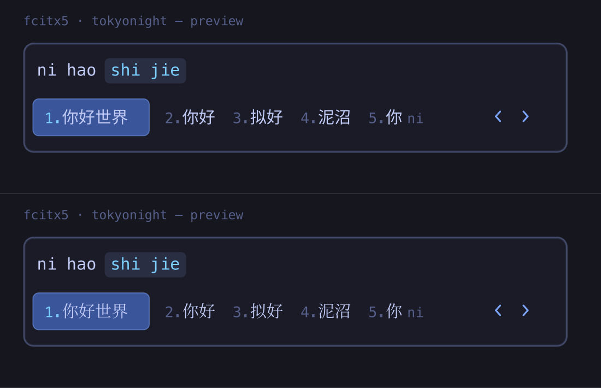
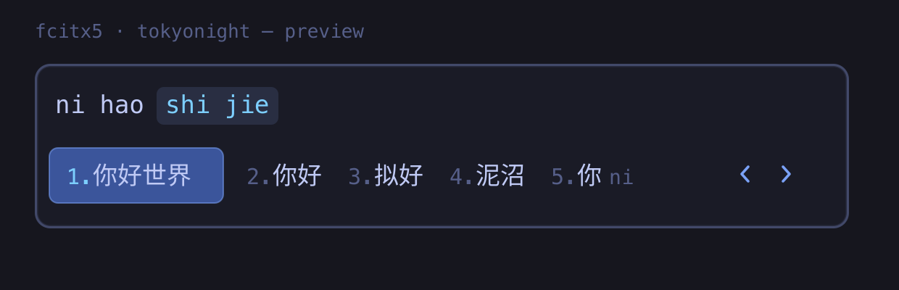

# 05 · 主题与 UI：noctalia 顶栏、配色联动、字体、壁纸、输入法

对应文件：`config/noctalia/`、`state/noctalia/`、`config/gtk-*`、`config/qt6ct/`、
`config/btop/`、`config/kdeglobals`、`config/fcitx5/`、`config/fontconfig/`、
`share/fcitx5/themes/`、`wallpaper/`

---

## 先搞清楚：桌面顶部那条 bar 是 **Noctalia**，不是 waybar

`noctalia` 包，用 Quickshell 写的 Wayland shell。系统上**没有** `~/.config/waybar`——
找 bar 配置时第一反应去翻 waybar / eww / ags，全都不存在，会白绕一圈。

它由 `~/.config/hypr/config/autostart.lua` 里的 `hl.exec_cmd("noctalia")` 拉起。

常用命令：

```bash
noctalia config export full     # 打印【全部】键含默认值 —— 这是唯一可靠的查询方式
noctalia config validate        # 校验
noctalia msg config-reload      # 热重载
noctalia msg --help             # 列出全部 IPC 命令（bar / dock / 媒体 / 亮度 / 面板…）
```

`config.toml` **只存非默认项**，直接读文件是看不到有哪些可选项的。所以想知道某个东西
能不能配、叫什么名字，一律用 `noctalia config export full` 而不是读配置文件。

---

## ★ 配置分裂在两个文件里

这是这套配置最容易踩的一个坑：

| 文件 | 管什么 | 谁在写 |
|---|---|---|
| `~/.config/noctalia/config.toml` | 顶栏布局、widget、shell 行为、截图/会话动作 | 手写 |
| `~/.local/state/noctalia/settings.toml` | **主题来源、调色板、壁纸路径、锁屏部件** | noctalia 设置界面 |

两边的 `[theme]` 段**重叠**，实测以 `settings.toml` 为准：

```toml
# ~/.config/noctalia/config.toml  —— 【这一段】被 state 覆盖，不生效
[theme]
source = "wallpaper"

# ~/.local/state/noctalia/settings.toml  —— 实际生效
[theme]
source = "community"
community_palette = "Tokyo Night Moon"
mode = "dark"
```

`noctalia config export full` 打印出来的是 `source = "community"`，以它为准。

⚠ **只有重叠的 `[theme]` 段是这样，别推广成「config.toml 整个文件已过时」。**
`[shell]`（含 `greeter_sync`、clipboard 各项）、`[storage]`、`[bar.*]`、`[widget.*]`
都只在 config.toml 里，全部正常生效——2026-08-27 的 greeter 免密和剪贴板持久化两处
改动都写在这个文件里并实测生效。判断某个键到底生效没有，一律 `noctalia config export full`。

**后果**：只把 `~/.config/noctalia/config.toml` 拷到新机器，顶栏布局对了，但**配色
完全不对**。所以本包额外带了 `state/` 目录（含 `settings.toml` 和
`community-palettes/Tokyo%20Night%20Moon.json`）。

`install.sh` 的 `ui` 模块会自动把 `settings.toml` 里的 `/home/david` 路径改写成新机的
`$HOME`。但里面的显示器名 **`DP-1` 是写死的**——新机输出名不同的话壁纸不会自动上屏，
在 noctalia 设置里重选一次壁纸即可。

---

## 配色是怎么传导到每个程序的

noctalia 有一套模板引擎，把当前调色板渲染成各程序的配置文件：

```toml
# config.toml
[theme.templates]
builtin_ids = [ "btop", "gtk3", "gtk4", "kcolorscheme", "kitty", "qt", "alacritty" ]
```

于是这七个文件是**产物**，不是手写的：

| 产物 | 被谁引用 |
|---|---|
| `~/.config/kitty/themes/noctalia.conf` | `kitty.conf` 末行 `include` |
| `~/.config/alacritty/themes/noctalia.toml` | `alacritty.toml` 的 `[general] import` |
| `~/.config/btop/themes/noctalia.theme` | `btop.conf` 的 `color_theme = "noctalia"` |
| `~/.config/gtk-4.0/noctalia.css` | `gtk-4.0/gtk.css` 的 `@import` |
| `~/.config/qt6ct/colors/noctalia.conf` | `qt6ct.conf` 的 `color_scheme_path` |
| `~/.config/kdeglobals` | KDE 系应用（dolphin 等）直接读 |
| GTK3 | 走 `gtk-3.0/settings.ini` 的 `adw-gtk3` 主题 |

> **改配色的正确入口是 noctalia，不是编辑上面这些文件。** 手改了下次换壁纸/换调色板
> 就被覆盖回去。本包带这些产物只是为了避免新机首次启动时 `include` 一个不存在的文件。

`~/.local/state/noctalia/community-templates/` 下还有 ~45 个社区模板没启用
（neovim、lazygit、vscode、rofi、yazi、zellij、obsidian、firefox…）。想让某个程序也
跟着换色，把它的 id 加进 `builtin_ids` 即可。

### `qt6ct.conf` 里的 `$USER` 陷阱

发行版 skel 里这行写的是字面量：

```ini
color_scheme_path=/home/$USER/.config/qt6ct/colors/noctalia.conf
```

qt6ct **不做变量展开**，所以在用户名不是 `$USER` 这四个字母的机器上这是个死路径，
表现为 Qt 应用配色不生效。`install.sh` 会自动替换成真实 `$HOME`。

### LibreOffice：必须显式钉 VCL 后端

LibreOffice 靠自动探测选绘制后端，而 **Hyprland 不在它的已知桌面列表里**，探测会退到
`gen`——X11 裸绘制，主题完全不跟随（上表 GTK3 那行的 `adw-gtk3` 白写了），输入法还得走
XIM。所以在 `~/.config/uwsm/env` 里钉死：

```sh
export SAL_USE_VCLPLUGIN=gtk3
```

选 `gtk3` 而不是别的：它跟随 `adw-gtk3`，且 Wayland 下最稳。**不用 `qt6` / `kf6`**——
Wayland 下有已知滚动卡顿（[tdf#152911](https://bugs.documentfoundation.org/show_bug.cgi?id=152911)）。

本机可用后端列表：

```bash
ls /usr/lib/libreoffice/program/libvclplug_*.so
# → gen · gtk3 · gtk4 · kf6 · qt6
```

⚠️ **`uwsm/env` 是会话级的，登录时才读一次**（见 [03](03-terminal.md)）。改完必须重新登录，
在已开的终端里 `echo $SAL_USE_VCLPLUGIN` 是空的属正常，不代表没配上。

---

## 顶栏布局

```
┌────────────────────────────────────────────────────────────────────────┐
│ 启动器 时钟   [温度 GPU温度 内存]  │ 工作区  当前窗口 │  媒体  托盘 通知 网络 音量 电源 │
└────────────────────────────────────────────────────────────────────────┘
   start ─────────────────────────    center ──────────    end ──────────────────────
```

| 键 | 值 | 效果 |
|---|---|---|
| `auto_hide` + `smart_auto_hide` | false / false | 2026-09-09 起关闭：两者都自带"指针到达顶边即 reveal"的命中条，鼠标划过顶部点标签页之类操作很容易被误触发弹出。改成纯 IPC 手动控制（见下） |
| `reserve_space` | false | 不为它预留布局空间，窗口可以顶到屏幕最上沿 |
| `thickness` / `scale` | 35 / 1.10 | 栏高与栏内元素缩放 |
| `radius_bottom_*` / `concave_edge_corners` | 12 / true | 下方两角圆角，边缘内凹 |
| `[accessibility] ui_scale` | 1.20 | 整个 noctalia UI（面板、启动器、设置）放大 20% |

`group:g1` 是一个 capsule 分组，把「温度 / GPU 温度 / 内存」三个 sysmon 装进同一个
胶囊里（`fill = "on_secondary"`），视觉上是一块而不是三块。工作区和托盘也各自开了
capsule。多数 widget 设了 `color = "secondary"`，电源键是 `error`（红）。

时钟格式 `{:%H:%M %A %m/%d/%y}`。

`ALT+9` 手动开合顶栏（走 `noctalia msg bar-toggle`，见 [02](02-hyprland.md)）。
其他相关 IPC：`bar-hide` / `bar-show` / `bar-reserve-toggle` / `bar-auto-hide-set`。

顶栏默认收着，只在切工作区时用 `bar-show` 弹出 1.5 秒后 `bar-hide` 自动收回——
逻辑在 `~/.config/hypr/mykeys.lua` 第 9 节（`hl.on("workspace.active", ...)` +
`hl.timer`），不是 noctalia 自带能力，也不放官方 `config/*.lua` 里，理由同
[02](02-hyprland.md) 的 mykeys.lua 设计。

### 截图 → satty

```toml
[shell.screenshot]
pipe_to_command = true
pipe_command = "satty -f -"
save_to_file = true        # ← 2026-08-26 由 false 改成 true
copy_to_clipboard = false
```

截图管道进 satty 标注工具，**同时**落盘到 `~/Pictures`。
剪贴板里的图片也走 satty（`clipboard_image_action_command`）。

★ `save_to_file` 原本是 `false`，意味着截图**只**存在于 satty 的窗口里——
不在 satty 里手动保存，关掉窗口图就没了，且事后无迹可寻。
改成 `true` 后两条路径并存：satty 照常弹出供标注，不标注也不丢图。
`copy_to_clipboard` 保持 `false`——满屏截图直接塞进剪贴板容易误粘，
需要复制时在 satty 里按一下更可控。

### 录屏 → wl-screenrec

截图是 noctalia 内建的（`noctalia msg screenshot-*`），**录屏不是**——
noctalia 的 IPC 命令表里没有任何 record 命令，所以这块是自己搭的：
`~/.local/bin/hypr-screenrec` 包一层 wl-screenrec，键位见 [06](06-keymap-cheatsheet.md)。

选 wl-screenrec 而不是 OBS / wf-recorder：它是 wlroots 原生，帧从合成器经
DMA-BUF 直接进 VAAPI 编码器，全程不过 CPU。实测 2560×1440@60 录制时只占 **2.4%** CPU。

三个必须知道的坑：

**1. 停止必须用 SIGINT，不能用 SIGTERM。** wl-screenrec 靠 Ctrl-C 那条路径 flush
编码器并写 mp4 的 moov atom，杀错信号会得到一个没有索引、播放器直接打不开的文件。
脚本发完 `kill -INT` 还要轮询等进程真正退出（最多 5 s）才报「已保存」，
否则通知弹出时文件还没写完。验收就看 `ffprobe` 能否读出 duration。

**2. AMD 上要显式 `--low-power=off`。** Mesa VAAPI 没有 low-power 编码入口，
不关掉的话每次启动先失败一次再回退，白等一下还刷两行
`No usable encoding entrypoint found for profile` 报错。

**3. 带 transform（旋转）的显示器上不工作。** 同样是 Mesa VAAPI 的限制。
本机 DP-1 `transform: 0` 不受影响；真要录旋转屏只能换 OBS。

其余设计取舍：`--bitrate` 单位是**字节/秒**（上游默认 `5 MB` 即 40 Mbps，对 1440p 偏高），
脚本里定 `2 MB` ≈ 16 Mbps。音频录默认 sink 的 monitor 源，每次启动时
`pactl get-default-sink` 动态解析，换声卡不用改脚本。全屏模式取当前**聚焦**的显示器
而不是「唯一那块」，接第二块屏直接可用。

★ 绑定时**不能**加 `uwsm app --` 前缀（`binds.lua` 里其他 GUI 程序都加了）——
uwsm 会把录屏进程放进另一个 cgroup，脚本的 pidfile 就追不上，变成停不下来。

### 电源菜单

浮动居中，五个动作按数字键触发：`1` 锁屏 · `2` 注销 · `3` 锁屏并挂起 ·
`4` 重启 · `5` 关机。后三个有 3 秒倒计时可以反悔，关机标了 `destructive`（红）。

---

## OSD ≠ 通知：换歌时顶部弹的东西治不了，多半是找错了子系统（2026-08-27）

**症状**：pear-desktop（YouTube Music）每换一首歌，屏幕顶部就弹一次「正在播放」，
不想要。直觉是「给这个应用关通知」，于是去翻 `[notification.filter.*]` ——
**那条路对它完全不生效**，因为它根本不是通知。

### 两个子系统，长得像，入口完全不同

| | 通知 | OSD |
|---|---|---|
| 来源 | D-Bus `org.freedesktop.Notifications` | noctalia 内部事件 |
| 本包默认位置 | `top_right` | `top_center` |
| 关闭入口 | `[notification.filter.*]` | `[osd.kinds]` |

**位置就是最快的判据**：弹在正中间靠上 = OSD，靠右上角 = 通知。

### 判定链（三条独立证据，别只信一条）

```bash
# 1. 应用侧压根没开通知插件
python3 -c "import json,os;print(json.load(open(os.path.expanduser(
  '~/.config/YouTube Music/config.json')))['plugins']['notifications'])"
# → {'enabled': False, ...}

# 2. 挂 D-Bus 实测：换歌期间 Notify 调用数为 0
dbus-monitor --session "interface='org.freedesktop.Notifications',member='Notify'"

# 3. ★ 最直接的一条：翻译文件里写死了这个 OSD 干什么的
python3 -c "import json;d=json.load(open(
  '/usr/share/noctalia/assets/translations/en.json'));
print(d['settings']['schema']['shell']['osd-kinds-media'])"
# → {'label': 'Now Playing',
#    'description': 'Show an OSD popup when a new track starts playing'}
```

第 3 条值得单独记：**`/usr/share/noctalia/assets/translations/en.json` 是查
「某个配置键到底管什么」的权威来源**，比二进制 `strings` 和官方文档站都靠谱
（`docs.noctalia.dev/v5/services/notifications/` 目前 404）。配合坑 9 里那招
`noctalia config validate` 枚举合法键名，一个查「有哪些键」、一个查「键是干嘛的」。

### 解法

```toml
# ~/.config/noctalia/config.toml
[osd.kinds]
media = false
```

**这是全局开关**，关的是所有播放器的换歌弹窗；noctalia **没有**按播放器关 OSD 的选项。
bar 上的 media widget 和播放控制不受影响。

真要只针对单个播放器，只有 `[shell.mpris] blacklist = [...]`，但那会把它从 media
widget 里一并摘掉，通常不是想要的。

`[osd.kinds]` 下同结构的还有：`bluetooth` · `brightness` · `caffeine` · `dnd` ·
`keyboard_backlight` · `keyboard_layout` · `lock_keys` · `nightlight` ·
`power_profile` · `privacy` · `volume` · `volume_input` · `volume_output` · `wifi`。

⚠ **验收要看眼睛，不能看 `config export`** —— 见坑 9：`config-reload` 只重读文件，
`export` 显示 `media = false` 不等于行为真的变了。实际换一首歌确认；还弹就
`kill $(pgrep -x noctalia); setsid -f noctalia -d` 重启进程再看。

**本例实测结论（2026-08-27）**：`[osd.kinds]` **吃 `config-reload`**，换歌验证已不再弹，
不用重启进程。即坑 9 那个「reload 不够」的毛病是**按配置段**而非全局的——
已知需要重启的只有 `[shell.launcher.providers.*]` 和 `[storage]` 两段。
新段别默认往坏处想，先 reload 试，不行再重启。

### 顺带：通知过滤器的完整字段（真需要按应用屏蔽通知时用）

字段名同样是 `noctalia config validate` 探出来的（未知键会报 `unknown setting`
但仍返回 valid），标签取自 `translations/en.json` 的 `settings.notifications.filter`：

```toml
[notification]
filter_order = [ "discord" ]      # 按序求值，第一条匹配的赢

    [notification.filter.discord]
    enabled = true
    match = "discord"             # App：app name / desktop entry / category，不分大小写、子串
    match_content = ""            # Content Regex：匹配 summary 或 body
    allowed_urgencies = []        # 非空时只放行 low/normal/critical 中列出的
    show_toast = false            # ← 屏蔽弹窗就是这个
    play_sound = false
    save_history = true           # 仍留在控制中心历史
    bypass_dnd = false            # 反向用法：让重要 app 穿透勿扰
    allow_permanent = false
    override_duration = 5
```

GUI 在 `noctalia msg settings-open notifications` → Filters → Add。

另外两个**不对症**的东西，别再试：☕ caffeine 是空闲抑制器（防息屏），跟通知无关；
🔔 DND 是全局的，且**不持久化**（`state.toml` 里无记录，重启回 off）。
要永久静音全部通知用 `[notification] enable_daemon = false`（连历史都不留），
或写一条 catch-all 过滤器（`match = ""` + `match_content = ".*"` + `save_history = true`）。

---

## 启动器：provider 模型

`ALT+Space` 拉起的启动器不是单一列表，是若干 **provider** 的聚合。合法 id 只有六个：

```
applications · windows · emoji · wallpaper · session · calculator
```

每个 provider 有且只有两个可配项，写在 `~/.config/noctalia/config.toml`：

```toml
[shell.launcher]

    # 无前缀搜索里也列出已打开的窗口，方便直接跳过去而不是再开一个
    [shell.launcher.providers.windows]
    global = true

    # 很少用启动器算数，把计算器从无前缀搜索里摘掉，免得抢第一行；/calc 仍可用
    [shell.launcher.providers.calculator]
    global = false
```

| 键 | 含义 |
|---|---|
| `global` | 是否参与**无前缀**搜索。false = 只能靠前缀触发 |
| `prefix` | 触发前缀，和 `provider_prefix`（默认 `/`）拼接。留空 = 用内置默认 |

内置默认前缀：`/win` · `/emo` · `/wall` · `/session` · `/calc`。
`applications` 没有前缀设置项——它是 default provider，无前缀时永远参与。

选中窗口回车时 noctalia 发的是 `hyprctl dispatch focuswindow address:0x…`，
Hyprland 会自动把视图切到该窗口所在工作区，跨显示器还会先 `focusmonitor`。

### 三条限制（2026-08-26 实测，别再重新调研）

1. **`noctalia msg config-reload` 不会重载 launcher 的 provider 注册。**
   改完 `[shell.launcher.providers.*]` 必须重启 noctalia 进程才生效：

   ```bash
   kill $(pgrep -x noctalia); setsid -f noctalia -d
   ```

   它由 Hyprland 的 `autostart.lua` 直接拉起，不是 systemd unit，没法 `systemctl restart`。

2. **没有跨 provider 的排序权重。** 探过 `weight` / `priority` / `order` / `enabled`，
   `noctalia config validate` 一律报 `unknown setting`。应用永远排在窗口前面。
   上游 [issue #2470](https://github.com/noctalia-dev/noctalia/issues/2470) 提的正是
   「输 firefox 时已开的窗口应该排在启动项前面」，**已 closed as not planned**，
   不用等了。想让某类结果靠后，唯一手段是把它的 `global` 关掉、退回前缀触发。

3. **窗口和应用没有徽章区分**，只能看副标题：

   | 副标题长这样 | 是 |
   |---|---|
   | `An open source cross-platform alternative to AirDrop` | 应用（.desktop 的 Comment） |
   | `localsend` | 窗口（窗口 class，永远是单个小写词） |

   `show_app_origin_indicator` 那个开关只给应用打 System/Flatpak/Nix 来源标，和窗口无关。

另外模糊匹配是**子序列**匹配，很松：搜 `localsend` 会把标题为
`GitHub - noctalia-dev/noctalia: A sleek, customizable…` 的 firefox 窗口也捞出来
（能挑出 l-o-c-a-l-s-e-n-d）。噪声比预期多，属预期行为不是 bug。

### 排查手法

活配置一律用 `noctalia config export full`（读的是合并后的生效值），
`noctalia config validate <file>` 会对不认识的键报 `unknown setting`、
对不存在的 provider 报 `provider is nonexistent`——拿它当探针可以枚举出合法键名。

---

## 剪贴板：`SUPER+V` 的历史靠 `[storage]` 文件密钥才能活过重启

先认清是谁在干活：**这个剪贴板是 noctalia 自己的 `ClipboardService`**，走 Wayland 的
`ext_data_control_manager_v1` 协议。既不是 Hyprland 的（合成器根本没有剪贴板历史这个功能），
也**不是 cliphist**（本机没装，别去找 `~/.cache/cliphist/db`）。

### 症状与根因（2026-08-27）

历史每次重启清零。根因不是「它不支持持久化」，恰恰相反——它**坚持加密后才落盘**，
主密钥默认从 Secret Service 取，而本机没跑任何 provider（gnome-keyring / kwallet 都没启用），
于是每次启动都报：

```
[WRN] [secret-store] operation=lookup scope=storage status=unavailable
      category=provider-unavailable default-collection=unknown
```

设计上它宁可丢也不明文存，所以降级成「仅本会话可用」。

### 解法：文件密钥，绕开整个 Secret Service

noctalia 官方为声明式配置（NixOS/agenix 那类）留了出口，正好拿来用——**不装 keyring、
不改 PAM、不需要 sudo**：

```toml
# ~/.config/noctalia/config.toml
[storage]
key_source = "file"
key_file = "/home/david/.config/noctalia/storage.key"
```

密钥是 64 位小写十六进制（32 随机字节）：

```bash
umask 077
head -c 32 /dev/urandom | xxd -p -c 64 > ~/.config/noctalia/storage.key   # 权限必须 0600
```

### ★ 改完必须重启进程，`config-reload` 不算

这一条最坑：`noctalia msg config-reload` **不会重新初始化存储子系统**。
`noctalia config export` 会显示 `[storage]` 已生效，但磁盘上死活不出现文件——
很容易误判成配置写错了又去改配置。没有官方 restart 命令：

```bash
kill -TERM $(pgrep -x noctalia)
hyprctl dispatch 'hl.dsp.exec_cmd("noctalia")'   # 用 hyprctl 拉起，会话环境才正确
```

（和[启动器 provider 那条限制](#三条限制2026-08-26-实测别再重新调研)同源：
`config-reload` 只重读文件，不重新注册子系统。）

### 验收

| 检查 | 期望 |
|---|---|
| 目录 | `~/.local/state/noctalia/clipboard/` 出现，`0700` |
| 文件 | `index.enc` + `entries/*.enc`，均 `0600` |
| 确实加密 | `index.enc` 头 8 字节是 magic `NOCTALIAENC1`，其后为密文 |
| 无明文泄漏 | `grep -r '<刚复制的测试串>' ~/.local/state/noctalia/` 无结果 |
| **重启后读回** | 日志出现 `[INF] [clipboard] loaded encrypted clipboard history` |

失败的样子是重启后日志写 `clipboard history size=NN entries=1`（归零重来）。

### 注意事项

- ⚠ **`storage.key` 丢了 = 旧历史永久读不出来。** 换密钥不会重新加密，只是认证失败；
  加密文件本身会保留，换回原密钥即可恢复。它**不入包**（见 CLAUDE.md 的边界章节），
  新机器要重新生成——代价是旧历史读不出来，可接受。
- 本机**无全盘加密**（btrfs 裸盘），所以主密钥等于明文躺在盘上，只靠 `0600` 保护。
  接受这个取舍的理由：能读到该文件的人已经有本用户权限了，那他直接问 D-Bus 要
  keyring 里的东西也一样拿得到；真正的差别只在**离线磁盘攻击**这一个场景。
  真在意就该先上全盘加密，而不是纠结这一个文件。
- 相关配置项（都在 `[shell]`）：`clipboard_history_max_entries` 默认 **100**、
  范围 10–10000、**只算未 pin 的条目**；`clipboard_enabled`、`clipboard_auto_paste`
  （`off|auto|ctrl_v|ctrl_shift_v|shift_insert`）、`clipboard_keep_from_closed_apps`。
- noctalia 会自动检测**在它之后**才启动的 Secret Service provider（一旦有进程 claim
  `org.freedesktop.secrets` 就自动重开加密存储），所以哪天改用 keyring 也不用担心启动顺序竞态。

---

## greeter 同步：换壁纸/主题为什么每次都要输密码

`[shell.greeter_sync] auto_sync = true` 会在换壁纸或配色时，把结果推给 greetd 登录界面
（写 `/var/lib/noctalia-greeter/`，属主 `greeter:greeter` `0750`），这一步要提权。

### 根因：它默认用 `run0`，绕开了自带的 policy（2026-08-27）

`noctalia-greeter` 包装了 polkit policy `org.noctalia.greeter.apply-appearance`，
但 noctalia **默认挑 `run0`** 提权。run0 是靠起临时 systemd unit 干活的，请求的 action 是
`org.freedesktop.systemd1.manage-units`，**根本不经过那个 policy**：

```
polkitd: Operator of unix-session:3 FAILED to authenticate to gain authorization
  for action org.freedesktop.systemd1.manage-units [run0 noctalia-greeter-apply-appearance ...]
```

所以照着 `apply-appearance` 那个 action 写 polkit 规则是**完全无效**的。
而 `manage-units` 又没法安全放行——run0 的 unit 名是随机的 `run-uNNNN.service`，
无法按命令区分，放行它等于全局 root 免密。

**排错通则：先看 journalctl 里真正被拒的 action id，别照着 policy 文件猜。**

### 解法：两步，缺一不可

**① 掰回 pkexec**（包里的 `config/noctalia/config.toml` 已含此项）：

```toml
[shell.greeter_sync]
auto_sync = true
privilege_command = "pkexec"
```

官方对该键的说明：*Replace pkexec/run0 for greeter Sync Now；helper 路径和 staging 目录
会自动追加*。

**② 系统侧放行**——⚠ 这一步**不在本包管辖范围**（`install.sh` 只写 `$HOME`，不碰系统），
新机器要手动建 `/etc/polkit-1/rules.d/49-noctalia-greeter.rules`：

```javascript
polkit.addRule(function(action, subject) {
    if (action.id == "org.noctalia.greeter.apply-appearance" &&
        subject.isInGroup("wheel") && subject.local && subject.active) {
        return polkit.Result.YES;
    }
});
```

`49-` 要排在 `50-default.rules` 前面；`/etc/` 优先级高于包自带的 `/usr/share/polkit-1/rules.d/`。
polkit 127 会自动重载，不用重启。

### 验收

```bash
pkcheck --action-id org.noctalia.greeter.apply-appearance --process $$   # → polkit.result=yes
noctalia msg greeter-sync                                                # 应无提示直接完成
```

journalctl 里应只剩 `pkexec: Executing command`，没有 polkitd 的 `FAILED to authenticate`。

### 边界与降级

- 规则带 `local && active`，**只有本地活跃会话免密**，SSH 进来换壁纸仍要密码（有意为之）。
- 若上游改了 action id 或键名，规则失配 → 退回弹窗（`polkit_agent = true` 开着，能正常弹），
  不会静默失败。
- 非活跃会话触发同步会走 timeout：文件 staged 下来并提示手动跑 `pkexec`，不会挂死。
- policy 里写的是 `auth_admin` 而非 `auth_admin_keep`，所以**不加规则的话每次都问、不缓存**。
- CachyOS 自带的 `/usr/share/polkit-1/rules.d/empower.rules` 是对 `empower` 组全 action 放行——
  别图省事往那个组里加人。

---

## 字体

| 用途 | 包 |
|---|---|
| **kitty 正文** | `adwaita-fonts`（Adwaita Mono，窄字形） |
| **图标（p10k / nvim）** | `ttf-meslo-nerd`（**必装**，缺了全是豆腐块） |
| **中文首选** | `ttf-sarasa-gothic`（更纱黑体，806 MB） |
| 中文兜底 | `noto-fonts-cjk` |
| Emoji | `noto-fonts-emoji` |
| 界面 | `cantarell-fonts`、`ttf-opensans` |
| 兜底 | `noto-fonts`、`ttf-dejavu`、`ttf-liberation`、`ttf-bitstream-vera` |

**kitty 是两个字体拼的**：正文 Adwaita Mono，Nerd Font 私用区码位用 `symbol_map`
单独映射给 MesloLGS Nerd Font Mono。少装任何一个都会出问题——缺 adwaita 就回退到
fontconfig 的 `monospace`，缺 meslo 则图标变豆腐块。理由见
[03-terminal.md](03-terminal.md#字体adwaita-mono--meslo-补图标)。

alacritty 仍用 `monospace` 别名，由 fontconfig 自行解析，没有显式指定。

### `config/fontconfig/fonts.conf` —— 修汉字字形

**要解决的问题**：Arch/CachyOS 默认没有 CJK 语言排序配置，`/etc/fonts/conf.d/65-nonlatin.conf`
按字母序列出 Noto CJK 家族，`KR` 排在 `SC` 前面。结果是**汉字默认用韩文字形**
（`fc-match sans-serif:lang=zh-cn` → Noto Sans CJK KR），「直 / 骨 / 查 / 兌」等字
写法与简中习惯不同。这是「整体是 Tokyo Night，唯独中文看着别扭」的真实来源之一。

本包的 `fonts.conf` 分三层，全部用 `<match>` 写：

| 层 | 内容 | 为什么 |
|---|---|---|
| 一 | 钉住 Latin（Noto Sans/Serif/Mono）+ 其后接 CJK 链 | 英文数字观感完全不变，汉字逐字回退到中文字体 |
| 二 | `lang=zh-cn` 时把中文字体 `prepend_first` 到最前 | 单结果查询也能拿到中文字体 |
| 三 | `lang=ja/ko/zh-tw/zh-hk` 各自顶回区域字体 | 否则会被第一层钉住的简中字形抢走 |

**三个把人绊住的行为**（都实测过）：

1. **`mode="prepend"` 是插到「匹配到的那一项之前」，不是队首。**
   多条 `<match>` 叠加时要真正顶到第一位，必须用 `mode="prepend_first"`。
2. **`<alias>` + `<prefer>` 无论写在文件哪个位置，都会被排到所有 `<match>` 之前。**
   顺序敏感的场景一律用 `<match>`，不要混用。
3. **`fc-match X` 和 `fc-match -s X` 结果不同。**
   Pango / Qt 实际用的是排序后的 fontset，所以判断渲染效果**要看 `fc-match -s`**。
   本机 `fc-match sans-serif:lang=zh-cn` 至今仍返回 Latin 字体，看着像没生效，
   但 `-s` 的第一名是中文字体，实际渲染是对的。

验证（`install.sh ui` 会自动跑一次）：

```bash
for l in zh-cn ja ko zh-tw; do
    printf '%-6s -> ' "$l"; fc-match -s "sans-serif:lang=$l" | grep -iE 'CJK|Sarasa' | head -1
done
# 期望：zh-cn → Sarasa Gothic SC；ja → CJK JP；ko → CJK KR；zh-tw → CJK TC
```

### 关于更纱黑体：别指望它改变汉字长相

`ttf-sarasa-gothic` 排在中文链首位，但要明确它带来什么、不带来什么：

- **不会改变汉字字形**。更纱的中文部分**就是思源黑体**，与 Noto Sans CJK SC 同源。
  实测同样文字渲染成图对比，像素差异 **0.035%**，肉眼无差别。
- 真正的收益是 `Sarasa Mono SC` / `Sarasa Term SC` 的**严格 1:2 等宽**
  （终端里中英混排能对齐，Noto 做不到），以及更紧凑的字面和行高。
- 汉字「变好看」的功劳属于上面那节的 **KR → SC 修正**，与装不装更纱无关。

不装它整套配置照常工作，静默回退 Noto CJK SC。**要真正换汉字长相得换字族**，
比如 `Noto Serif CJK SC`（思源宋体，系统自带）。对比图：


## 光标

`gtk-3.0/settings.ini` 和 `uwsm/env` 里都写的 `Bibata-Modern-Ice`，但 **CachyOS 默认
不装这个包**（是 skel 里的一厢情愿）。不装就静默回退到 Adwaita 光标，没有任何报错，
只是样式不同。要一致就 `yay -S bibata-cursor-theme`。

## 默认打开方式：图片 → imv，音视频 → mpv

`config/mimeapps.list` 把 17 种图片类型钉给 imv、122 种音视频类型钉给 mpv，
两份清单都是从各自 `.desktop` 的 `MimeType=` 字段生成的，
覆盖范围正好等于程序真正支持的格式。

原始状态是：图片被 Chrome 接管、`svg`/`avif` 被 Firefox 接管，
而 `mp4`/`mkv`/`mov` **没有任何关联**（双击无响应）——本机原本既没有图片查看器
也没有视频播放器。

### 三个坑

**1. 不要用 `xdg-mime default app.desktop type1 type2 …` 一次传多个类型。**
它会把所有类型挤成**一个畸形的 key** 写进 `mimeapps.list`，形如
`image/png image/jpeg … image/qoi=imv-viewer.desktop`，而规范要求每行一条。
整行静默失效，`xdg-mime` 不报错。
正确做法是直接生成每行一条：读 `.desktop` 的 `MimeType=`，`tr ';' '\n'` 拆行后
`sed 's/$/=app.desktop/'`。注意 zsh **不做默认分词**，`printf '%s\n' $var` 对多行
字符串只会输出一次，要么 `${=var}` 要么全程走管道。

> 验证时容易被假象骗过：某个类型看起来「生效了」，其实是它本来就没有默认值，
> 新装的程序成了唯一声明该类型的应用，走 `mimeinfo.cache` 回退才对上的，
> 跟你写的配置无关。已有默认值的类型（比如被 Chrome 占着的 `image/png`）则纹丝不动。
> 用 `xdg-mime query default` 和 `gio mime` 两边交叉验证，后者还能看到候选列表。

**2. 图片绑的是 `imv-viewer.desktop`，不是系统的 `imv.desktop`。**
系统装了两个条目，`imv-dir.desktop` 的 `Exec` 是个包装脚本，单文件参数时执行
`imv -n "$1" "$(dirname "$1")"`——**加载整个目录并定位到点击的那张，可以左右翻页**；
直接绑 `imv.desktop` 就只有孤零零一张图。

但两个系统条目都带 `NoDisplay=true`（上游有意为之：imv 无参数启动没有意义，
不该出现在启动器里），代价是 dolphin 的「打开方式」列表里也看不到它。
所以包里自带一份 `share/applications/imv-viewer.desktop`——派生自 `imv-dir.desktop`、
去掉 `NoDisplay`、`Exec` 仍指向 `imv-dir` 以保留翻页。

★ **刻意用了新文件名，不是同名覆盖。** `~/.local/share/applications/` 优先级高于
`/usr/share/applications/`，同名是**全量遮蔽**而非字段合并——imv 升级新增格式支持时，
被遮蔽的那份不会同步，表现为「装了新版却打不开新格式」。独立命名则两边共存。
装完必须 `update-desktop-database`，否则新条目在「打开方式」里查不到
（`install.sh` 的 `mod_ui` 已代劳）。

**3. `.desktop` 里的 `Icon=` 要验证在当前主题里真的存在。**
imv 上游写的 `multimedia-photo-viewer` 在本机 Adwaita 和 breeze 里**都没有**，
菜单里会是空白占位。包里换成了 `image-x-generic`——两个主题都有且带 scalable SVG。
判断方法：`find /usr/share/icons/<主题> -name '<图标名>.*'`。

### mpv 默认不开硬解

`config/mpv/mpv.conf` 只有一行 `hwdec=auto-safe`。mpv 出厂默认是 `hwdec=no`（软解），
1440p/4K 会明显吃 CPU。开了之后本机实测走的是 **Vulkan**（RADV 的 Vulkan Video 解码），
不是 VAAPI——`auto-safe` 会按顺序试 vulkan → nvdec → vaapi，AMD 上 vulkan 先命中。
两者都是硬解，日志里 `Using hardware decoding (vulkan)` 即为生效。

## 已删掉的死配置

`~/.config/qt5ct/` 和 `~/.config/xsettingsd/` 在原机器上存在，但 `qt5ct` 和
`xsettingsd` 这两个程序**根本没装**——纯 skel 残留，改它们不产生任何效果。
本包没有收录，避免误导。

---

## 壁纸

当前壁纸：`~/Pictures/Wallpapers/tokyonight/D-ASCII/a1-紫调少女.png`
——即下面 `_ascii.py` 拿 `A-最搭/11-w55gjr.png`（紫调少女 · 黑底，纯黑底 + 淡紫人物
≈ `#bb9af7`，极简居中构图）生成的 ASCII 版本。主色 `#1A1B26`，占绝大多数像素。

> 真实生效路径以 `~/.local/state/noctalia/settings.toml` 的 `[wallpaper.monitors.*]`
> 为准（同 CLAUDE.md 坑 1：state 那份才是真的）。

⚠ **换壁纸时别忘了 `config/hypr/config/misc.lua` 的 `background_color`** ——
它取的是当前壁纸主色，用来消除开机时那 1.5 秒的内置壁纸闪烁。换了色系就要重新采样：

```bash
magick 新壁纸.png -colors 5 -format '%c' histogram:info: | sort -rn | head -1
```

**为什么需要它**（noctalia 是「盖」壁纸不是「设置」壁纸，底下压着 Hyprland 内置图）
见 `docs/02-hyprland.md`「开机时先闪一张陌生壁纸」与 CLAUDE.md 坑 15。

本包带了这一张（508 KB）+ 4 张 ASCII 成品（`wallpaper/ascii/`，2.1 MB，装到
`D-ASCII/`）。完整壁纸库 77 张 / 167 MB，太大，用脚本重新拉。

> ASCII 那 4 张是本包 `_ascii.py` 自己的产出，本来可以重生成——但**重生成依赖
> wallhaven 上的源图还在**，那个不可控，所以直接带成品兜底。

### 多主题一键切换（主题领导壁纸，非壁纸领导主题）

`bin/theme-switch`：按 `Super+Shift+T` 循环切换「精选主题」。每个主题 =
**人工精选的同调壁纸目录** + **官方社区调色板**（不是壁纸自动抽色）。

理念：让 noctalia 用`wallpaper` 抽色模式实时跟图换色是「壁纸领导主题」——但动漫平涂稿抽出来
往往偏成傻瓜色，很难保持 Rose Pine / Everforest 那种克制的高级灰调。所以反过来用
`community` 模式钉死调色板（色相克制、明度统一、作者精调），壁纸只负责视觉氛围。

| 主题 | 壁纸目录 | 调色板 | 匹配画面 |
|---|---|---|---|
| tokyonight | `~/Pictures/Wallpapers/tokyonight` | Tokyo Night Moon | 夜景、蓝紫调、雨夜霓虹 |
| rosepine | `.../rosepine` | Rose Pine Moon | 薰衣草紫天空、蓝调时刻、暖光室内 |
| everforest | `.../everforest` | Everforest（自定义 JSON） | 森林、苔藓、吉卜力乡村、治愈系 |
| dracula | `.../dracula` | Dracula（自定义 JSON） | 赛博朋克夜城、霓虹灯箱、紫粉青绿 |
| oxocarbon | `.../oxocarbon` | Oxocarbon | 冷白蓝灰、清冷克制 |

原理（每一步都是 IPC，改的是 `~/.local/state/noctalia/settings.toml`，即真相源）：

```bash
noctalia msg color-scheme-set community <名>   # 钉官方调色板
noctalia msg wallpaper-set <图>                # 设壁纸（持久到 default/monitors）
noctalia msg templates-apply                   # 渲染 gtk/kitty/btop/qt/alacritty
noctalia msg config-reload                     # 刷新 bar
noctalia msg greeter-sync                      # 锁屏配色同步
```

调色板是 `~/.local/state/noctalia/community-palettes/*.json`（`{dark,light}` 两档结构，
terminal.normal/bright 一套）。本包新加了 `Everforest.json`、`Dracula.json` 两个，
其余沿用社区自带。**自定义调色板照抄 `Rose Pine Moon.json` 的结构即可**，
关键 6 个 Material 键（mPrimary/mSecondary/mTertiary/mSurface/mSurfaceVariant/mOnSurface）
决定 bar 与 GTK 观感，terminal 段决定 kitty/btop。

加新主题三步：
1. `mkdir -p ~/Pictures/Wallpapers/<slug>/` 放精选壁纸（可带子目录，脚本递归取图，循环轮换）
2. 放 `.json` 到 `community-palettes/`（并在 `cachyOS-config/state/noctalia/community-palettes/` 同放一份供 install）
3. 在 `bin/theme-switch` 的 `THEMES` 数组加一行 `slug|Palette Name`，

⚠ **切主题会覆盖 `misc.lua` 的 `background_color` 的对齐值**——换了色系记得重新采样
（见上 `magick ... histogram` 命令），否则开机仍会闪一下内置壁纸。

## 壁纸库的生成管线

`wallpaper/tokyonight/` 下四个脚本：

| 脚本 | 作用 |
|---|---|
| `_fetch.py` / `_fetch2.py` | 按 Tokyo Night 调色板从 wallhaven 搜壁纸，结果存 `_picks*.json` |
| `_build.py` | 生成 `index.html` 预览页（带中文点评，按贴合度分 A/B/C/D 档） |
| `_ascii.py` | 把图片转成 Tokyo Night 配色的 ASCII art 壁纸（4K） |

`_fetch.py` 的筛选口径：以 Tokyo Night night/storm/moon 三个变体共通的 14 个色值
（`1a1b26` `24283b` `222436` `1f2335` `414868` `7aa2f7` `bb9af7` `7dcfff` `2ac3de`
`9ece6a` `c0caf5` `565f89` `f7768e` `9d7cd8`）为基准，用 wallhaven 支持的最接近的
5 个 seed 颜色去搜，再按色距重排。

`_fetch2.py` 修了第一版的一个偏差：**纯黑白图在 Lab 空间里离 `#1a1b26` 很近，会被误判成
"很搭"**，但它们只是暗，不是 Tokyo Night 的靛蓝紫调。所以加了两条惩罚——画面里没有
蓝紫色相（HSV hue 0.55–0.80）+22 分，整体彩度 < 12 再 +18 分。

重建：

```bash
cd ~/Pictures/Wallpapers/tokyonight
python _fetch.py && python _fetch2.py    # 拉图（需要网络）
python _build.py                          # 生成 index.html，浏览器打开挑
python _ascii.py                          # 重生成 D 档（约 4 秒）
```

分档目录：`A-最搭`（8 张）· `B-可选`（9）· `C-暗调单色`（8）· `D-ASCII`（12）·
`其他`（5）· `全部-软链`（37 个软链汇总）· `thumbs`（缩略图）。

> `全部-软链/` 是给 noctalia 壁纸面板用的——**它不递归扫子目录**，所以把好图平铺软链
> 到一层。面板目录指这里就能全看到；只想要最搭的就指 `A-最搭/`。

---

### `_ascii.py`：ASCII art 壁纸生成

依赖 **`imagemagick` + `librsvg`**（都在 `packages.txt`）。管线：

```
magick 裁切/降采样 → PPM → 字符映射 + Lab 调色板吸附 → SVG → rsvg-convert → PNG
```

每个字符在 SVG 里**显式指定 x 坐标**，不依赖字体 advance，网格必然对齐——这样换字体
也不会错位。默认 `MesloLGS Nerd Font Mono`、3840×2160、320 列。12 张约 4 秒。

底部 `JOBS` 是 kwargs 形式，加图就加一行：

```python
("A-最搭/27-vpe31p.jpg", "b1-霓虹房间", RAMP70, PALETTE,
 D(gamma=.72, boost=1.30, floor=.12, sig=4, cols=360, edge=.72,
   crop="2048x1152+3560+880")),
```

#### 四条调参经验（2026-08-26 试出来的，重装后别再踩一遍）

**1. `floor`（留白阈值）是观感的总开关。**
低于阈值的像素直接留空。`-auto-level` 会把纯黑背景抬起来，导致每个像素都够格分到一个
字符、满屏噪点（实测字符占屏能到 99%）。配合 `floor` 0.2–0.32 才干净。想更空就往上调，
想更满就往下。

**2. 颜色明度必须重映射到亮端**（`build_snap` 的 `lmin=46, lmax=94`）。
字符疏密已经负责表达结构了，颜色再跟着源像素一起变暗，暗部字符就几乎看不见、整张糊成
一团。正确做法是：**色相取自源像素，明度统一推到亮端**。

**3. 源图要选主体清楚、背景大片黑的。**
满构图的场景图转出来很吵。留白率高的（`a9-剪影极简` 0.7%、`a1-紫调少女` 2.7%）最耐看。

**4. 柔光插画必须开 `edge` 通道 —— 这条最容易白费时间。**
ASCII 只有"亮度"一个维度可用。白衣白发的人物站在浅色房间里，主体和背景挤在同一个亮度
带，**靠亮度根本分不开**：提列数（320→560）、拉阈值、加 unsharp 全部无效，而且越提越糊。
解法是改用 `-edge` 梯度幅值图驱动字符密度（`edge=0.72` 左右），轮廓和五官就画得出来了，
完全不依赖亮度差。再配合 `crop=` 裁紧构图，让主体占更多字符格。
`b1-霓虹房间` 就是这么救回来的。

反例对照：`a7-黑金属少女` 不需要 edge 通道，因为它本来就是纯黑底上一张白脸，亮度反差极大。

#### 关于 wallhaven 上的 ASCII art

**基本没有。** 用 10 组关键词（`ascii art` / `text art` / `terminal` / `dithering` /
`1bit` …）扫过，`ascii art` 只返回 7 条结果，人工看完 14 张候选只有 2 张能用
（`c1-点阵少女` `c2-网点少女`，已收在 `D-ASCII/`）。这个题材要自己生成，别浪费时间搜。

---

## 输入法：fcitx5 + rime

```
Default Layout = us
DefaultIM      = rime
```

`config/fcitx5/` 带了 `profile`（输入法组）、`config`（快捷键）、
`conf/notifications.conf` 和 `conf/classicui.conf`（外观）。
**rime 的词库和方案（`~/.local/share/fcitx5/rime/`）没有打包**——那是个人积累的数据，
且体积不定，换机时单独拷。

新机器上要让它在 Wayland 下正常工作，确认这些包都在：
`fcitx5` `fcitx5-rime` `fcitx5-gtk` `fcitx5-qt` `fcitx5-configtool`。
GTK/Qt 应用走对应的 im-module，Electron 应用靠 `ELECTRON_OZONE_PLATFORM_HINT=auto`
（已在 `uwsm/env`）。

### 候选框外观：`share/fcitx5/themes/tokyonight/`

装到 `~/.local/share/fcitx5/themes/tokyonight/`，由 `conf/classicui.conf` 的
`Theme=` / `DarkTheme=` 指向。默认主题在一整套 Tokyo Night 桌面里非常扎眼，
这个主题是为了消掉那个突兀感。



配色取 Tokyo Night，底色对齐 noctalia 的 `#1a1b26`（不是 Storm 的 `#24283b`）：

| 元素 | 色值 |
|---|---|
| 面板底 / 描边 | `#1a1b26` · `#414868` |
| 候选词 | `#c0caf5` |
| 序号 · 注释 | `#565f89`（压暗，减少干扰） |
| 选中胶囊 / 其描边 | `#3d59a1` · `#7aa2f7` |
| 选中项序号 | `#7dcfff` |
| 编码区高亮段 | `#7dcfff` on `#292e42` |

**PNG 是生成物，别直接改**。改 `.src/*.svg` 后跑 `.src/render.sh` 重建
（需要 `librsvg`）。`--preview` 参数会连 `docs/img/` 下的配图一起重生成。
9-patch 的 `Margin` 和 SVG 的圆角半径是配套的，改圆角要同步改 `theme.conf` 的 Margin。

#### theme.conf 的三个坑（fcitx5 5.1.21 实测）

1. **`Optional|Color` 类型的选项必须写成子小节 + `Value=`**，直接 `Key=#rrggbb`
   会被静默丢弃、既不报错也不生效。受影响的是这四个：
   ```ini
   [InputPanel/CandidateLabelColor]
   Value=#565f89
   ```
   （`CandidateLabelColor` / `HighlightCandidateLabelColor` /
   `CandidateCommentColor` / `HighlightCandidateCommentColor`。根因是
   fcitx5 把 `std::optional<T>` 序列化到 `config["Value"]` 子节点。）
2. **`LabelTextSizeFactor` / `CommentTextSizeFactor` 是整数百分比**
   （默认 100，范围 0–400）。写 `0.88` 会被解析成 `0`，序号和注释直接变零字号消失。
3. `[InputPanel]` **没有** `Spacing`（只 `[Menu]` 有）；
   `VerticalCandidateList` 在 5.1.21 的 classicui 里已不存在。

#### 验证与热重载（不用重启 fcitx5，也不用开 GUI）

```bash
# 改完配置让它立刻生效
gdbus call --session --dest org.fcitx.Fcitx5 --object-path /controller \
  --method org.fcitx.Fcitx.Controller1.ReloadAddonConfig "classicui"

# 看解析后的【生效值】+ 每个选项的类型描述 —— 判断「键名对不对 / 值有没有被吃掉」的唯一可靠手段
gdbus call --session --dest org.fcitx.Fcitx5 --object-path /controller \
  --method org.fcitx.Fcitx.Controller1.GetConfig \
  "fcitx://config/addon/classicui/theme/tokyonight"
```

注意 `/config/addon/classicui` 这个 dbus 对象路径**不存在**，只能走 `/controller`
的 `GetConfig`。`install.sh ui` 结尾会自动执行上面第一条。

### `conf/classicui.conf` —— 字体与两个必关的开关

```ini
Font="MesloLGS Nerd Font,Sarasa Gothic SC,Noto Sans CJK SC 13"
```

**逗号回退链**：Nerd Font 没有汉字字形，必须把中文字体显式列在后面，
Pango 会按顺序逐字回退。结果是拼音编码区和序号走 Meslo（跟终端同一个调子），
汉字走更纱 / Noto。字体在这个文件里，**不在 theme.conf 里**。

两个开关值得单独说：

- **`UseAccentColor=False`** —— 开着的话桌面强调色会覆盖主题的边框和选中色，
  正是「输入法看着不搭」的一大来源。
- **`UseDarkTheme=False`** + `Theme` 和 `DarkTheme` 都指向 `tokyonight` ——
  防止系统在明暗配色方案间切换时跳回默认主题。
